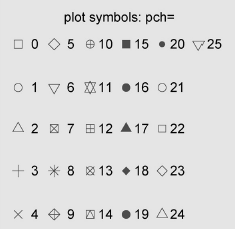
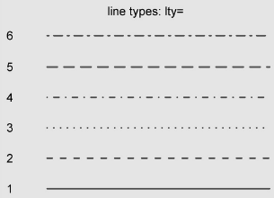

---
output:
  pdf_document:
    includes:
      in_header: header.tex
    latex_engine: xelatex
    toc: yes
  html_notebook:
    toc: yes
  html_document:
    toc: yes
  word_document:
    toc: yes
---

# 图形初步
***

在本章中，我们将讨论处理图形的一般方法。我们首先探讨如何创建和保存图形，然后关注如何修改那些存在于所有图形中的特征，包括图形的标题、坐标轴、标签、颜色、线条、符号和文本标注。我们的焦点是那些可以应用于所有图形的通用方法。（在后续各章，我们将关注特定类型的图形。）最后，我们将研究组合多幅图形为单幅图形的各种方法。

## 使用图形
R是一个惊艳的图形构建平台。这里我特意使用了构建一词。在通常的交互式会话中，你可以通过逐条输入语句构建图形，逐渐完善图形特征，直至得到想要的效果。
```{r}
attach(mtcars)
plot(wt, mpg)
abline(lm(mpg~wt))
title("Regression of MPG on Weight")
detach(mtcars)
```
可以通过代码或图形用户界面来保存图形。要通过代码保存图形，将绘图语句夹在开启目标图形设备的语句和关闭目标图形设备的语句之间即可。例如，以下代码会将图形保存到当前工作目录中名为mygraph.pdf的PDF文件中：
```{r}
pdf("mygraph.pdf")
attach(mtcars)
plot(wt, mpg)
abline(lm(mpg~wt))
title("Regression of MPG on Weight")
detach(mtcars)
dev.off()
```
除了 pdf() ，还可以使用函数 win.metafile() 、 png() 、 jpeg() 、 bmp() 、 tiff() 、 xfig()和 postscript() 将图形保存为其他格式。

## 一个简单的例子
让我们从表中给出的假想数据集开始。它描述了病人对两种药物五个剂量水平上的响应情况。

|剂 量|  对药物 A 的响应|  对药物 B 的响应|
|:-----:|:------:|:---------:|
|20 | 16  |15|
|30|  20|  18|
|40|  27|  25|
|45|  40|  31|
|60|  60|  40|

可以使用以下代码输入数据：
```{r}
dose <- c(20, 30, 40, 45, 60)
drugA <- c(16, 20, 27, 40, 60)
drugB <- c(15, 18, 25, 31, 40)
```
使用以下代码可以创建一幅描述药物A的剂量和响应关系的图形：
```{r}
plot(dose, drugA, type="b")
```
 plot(x, y, type="b") 将 x 置于横轴，将 y 置于纵轴，绘制点集(x, y)，然后使用线段将其连接。选项 type="b" 表示同时绘制点和线。使用 help(plot) 可以查看其他选项。

## 图形参数
我们可以通过修改称为图形参数的选项来自定义一幅图形的多个特征（字体、颜色、坐标轴、标签）。一种方法是通过函数 par()来指定这些选项。以这种方式设定的参数值除非被再次修改，
否则将在会话结束前一直有效。
不加参数地执行 par() 将生成一个含有当前图形参数设置的列表。添加参数 no.readonly=TRUE 可以生成一个可以修改的当前图形参数列表。
继续我们的例子，假设你想使用实心三角而不是空心圆圈作为点的符号，并且想用虚线代替实线连接这些点。你可以使用以下代码完成修改：
```{r}
opar <- par(no.readonly=TRUE)
par(lty=2, pch=17)
plot(dose, drugA, type="b")
par(opar)
```
你可以随心所欲地多次使用 par() 函数，即 par(lty=2, pch=17) 也可以写成：
par(lty=2)
par(pch=17)
指定图形参数的第二种方法是为高级绘图函数直接提供 optionname=value 的键值对。这种情况下，指定的选项仅对这幅图形本身有效。你可以通过代码：
plot(dose, drugA, type="b", lty=2, pch=17)
来生成与上图相同的图形。

### 符号和线条
用于指定符号和线条类型的参数

|参 数  |描 述|
|:------|:--------------------------------------------------|
|pch|指定绘制点时使用的符号，参见图1|
|cex|指定符号的大小。cex是一个数值，表示绘图符号相对于默认大小的缩放倍数。默认大小为 1，1.5 表示放大为默认值的 1.5倍，0.5表示缩小为默认值的50%，等等|
|lty|指定线条类型，见图2|
|lwd|指定线条宽度。 lwd 是以默认值的相对大小来表示的（默认值为 1）。例如， lwd=2 将生成一条两倍于默认宽度的线条|

图1 符号 


图2 线条



综合以上，下列代码：
```{r}
plot(dose, drugA, type="b", lty=3, lwd=3, pch=15, cex=2)
```

### 颜色
用于指定颜色的参数

|参 数|  描 述|
|:----------|:--------------------------------------------|
|col|默认的绘图颜色。某些函数（如 lines 和 pie）可以接受一个含有颜色值的向量并自动循环使用。例如，如果设定 col=c("red", "blue") 并需要绘制三条线，则第一条线将为红色，第二条线为蓝色，第三条线又将为红色|
|col.axis|坐标轴刻度文字的颜色|
|col.lab|坐标轴标签（名称）的颜色|
|col.main|标题颜色|
|col.sub|副标题颜色|
|fg|图形的前景色|
|bg|图形的背景色|

在R中，可以通过颜色下标、颜色名称、十六进制的颜色值、RGB值或HSV值来指定颜色。举例来说， col=1 、 col="white" 、 col="#FFFFFF" 、 col=rgb(1,1,1) 和 col=hsv(0,0,1)都是表示白色的等价方式。函数 rgb()可基于红－绿－蓝三色值生成颜色，而 hsv() 则基于色相－饱和度－亮度值来生成颜色。

```{r}
plot(dose, drugA, type="b", lty=3, lwd=3, pch=15, cex=2,col="red")
```

### 文本属性
图形参数同样可以用来指定字号、字体和字样。下表阐释了用于控制文本大小的参数。字体族和字样可以通过字体选项进行控制。

用于指定文本大小的参数

|参 数|  描 述|
|:--------|:---------------------------------|
|cex|表示相对于默认大小缩放倍数的数值。默认大小为 1，1.5 表示放大为默认值的 1.5 倍，0.5表示缩小为默认值的 50%，等等|
|cex.axis|坐标轴刻度文字的缩放倍数。类似于 cex|
|cex.lab|坐标轴标签（名称）的缩放倍数。类似于 cex|
|cex.main|标题的缩放倍数。类似于 cex|
|cex.sub|副标题的缩放倍数。类似于 cex|

用于指定字体族、字号和字样的参数

|参 数|  描 述|
|:--------|:----------------------------------|
|font|整数。用于指定绘图使用的字体样式。1=常规，2=粗体，3=斜体，4=粗斜体，5=符号字体（以 Adobe符号编码表示）|
|font.axis|坐标轴刻度文字的字体样式|
|font.lab|坐标轴标签（名称）的字体样式|
|font.main|标题的字体样式|
|font.sub|副标题的字体样式|
|ps|字体磅值（1 磅约为 1/72英寸）。文本的最终大小为 ps*cex|
|family|绘制文本时使用的字体族。标准的取值为 serif （衬线）、 sans （无衬线）和 mono （等宽）|

举例来说，在执行语句：
par(font.lab=3, cex.lab=1.5, font.main=4, cex.main=2)
之后创建的所有图形都将拥有斜体、1.5倍于默认文本大小的坐标轴标签（名称），以及粗斜体、2倍于默认文本大小的标题。

### 图形尺寸和边界尺寸
用于控制图形尺寸和边界大小的参数

| 参 数  |  描 述|
|:--------------|:--------------------------------------|
|pin    |以英寸表示的图形尺寸（宽和高）|
|mai    |以数值向量表示的边界大小，顺序为“下、左、上、右”，单位为英寸|
|mar    |以数值向量表示的边界大小，顺序为“下、左、上、右”，单位为英分。默认值为 c(5, 4, 4, 2) + 0.1|

```{r}
opar <- par(no.readonly=TRUE)
par(pin=c(2, 3))
par(lwd=2, cex=1.5)
par(cex.axis=.75, font.axis=3)
plot(dose, drugA, type="b", pch=19, lty=2, col="red")
plot(dose, drugB, type="b", pch=23, lty=6, col="blue", bg="green")
par(opar)
```

## 添加文本、自定义坐标轴和图例
除了图形参数，许多高级绘图函数（例如 plot 、 hist 、 boxplot ）也允许自行设定坐标轴和文本标注选项。举例来说，以下代码在图形上添加了标题（ main ）、副标题（ sub ）、坐标轴标签（ xlab 、 ylab ）并指定了坐标轴范围（ xlim 、 ylim ）。

```{r}
plot(dose, drugA, type="b",
col="red", lty=2, pch=2, lwd=2,
main="Clinical Trials for Drug A",
sub="This is hypothetical data",
xlab="Dosage", ylab="Drug Response",
xlim=c(0, 60), ylim=c(0, 70))
```

当图形中包含的数据不止一组时，图例可以帮助你辨别出每个条形、扇形区域或折线各代表哪一类数据。我们可以使用函数 legend()来添加图例（果然不出所料）。其使用格式为：
legend(location, title, legend, ...)

图例选项

|选 项|  描 述|
|:--------|:---------------------------------------------|
|location|有许多方式可以指定图例的位置。你可以直接给定图例左上角的 x、y坐标，也可以执行 locator(1) ，然后通过鼠标单击给出图例的位置，还可以使用关键字 bottom 、 bottomleft 、 left 、 topleft 、 top 、topright 、 right 、 bottomright 或 center 放置图例。如果你使用了以上某个关键字，那么可以同时使用参数 inset= 指定图例向图形内侧移动的大小（以绘图区域大小的分数表示）|
|title|图例标题的字符串（可选）|
|legend|图例标签组成的字符型向量|
|…|其他选项。如果图例标示的是颜色不同的线条，需要指定 col =加上颜色值组成的向量。如果图例标示的是符号不同的点，则需指定 pch =加上符号的代码组成的向量。如果图例标示的是不同的线条宽度或线条类型，请使用 lwd =或 lty=加上宽度值或类型值组成的向量。要为图例创建颜色填充的盒形（常见于条形图、箱线图或饼图），需要使用参数 fill= 加上颜色值组成的向量|

其他常用的图例选项包括用于指定盒子样式的 bty 、指定背景色的 bg 、指定大小的 cex ，以及指定文本颜色的 text.col 。指定 horiz=TRUE 将会水平放置图例，而不是垂直放置。关于图例的更多细节，请参考 help(legend) 。

实例：依剂量对比药物A和药物B的响应情况
```{r}
dose <- c(20, 30, 40, 45, 60)
drugA <- c(16, 20, 27, 40, 60)
drugB <- c(15, 18, 25, 31, 40)
opar <- par(no.readonly=TRUE)
par(lwd=2, cex=1.5, font.lab=2)
plot(dose, drugA, type="b",
pch=15, lty=1, col="red", ylim=c(0, 60),
main="Drug A vs. Drug B",
xlab="Drug Dosage", ylab="Drug Response")
lines(dose, drugB, type="b",
pch=17, lty=2, col="blue")
abline(h=c(30), lwd=1.5, lty=2, col="gray")
#library(Hmisc)
#minor.tick(nx=3, ny=3, tick.ratio=0.5)
legend("topleft", inset=.05, title="Drug Type", c("A","B"),
lty=c(1, 2), pch=c(15, 17), col=c("red", "blue"))
par(opar)
```

我们可以通过函数 text() 和 mtext() 将文本添加到图形上。 text() 可向绘图区域内部添加文本，而 mtext() 则向图形的四个边界之一添加文本。使用格式分别为：

text(location, "text to place", pos, ...) 

mtext("text to place", side, line=n, ...) 

实例：#一幅散点图（车重与每加仑汽油行驶英里数）的示例，各点均添加了标签（车型）
```{r}
attach(mtcars)
plot(wt, mpg,
main="Mileage vs. Car Weight",
xlab="Weight", ylab="Mileage",
pch=18, col="blue")
text(wt, mpg,
row.names(mtcars),
cex=0.6, pos=4, col="red")
detach(mtcars)
```

## 图形的组合
在R中使用函数 par() 或 layout() 可以容易地组合多幅图形为一幅总括图形。
你可以在 par() 函数中使用图形参数 mfrow=c(nrows, ncols) 来创建按行填充的、行数为nrows 、列数为 ncols 的图形矩阵。另外，可以使用 mfcol=c(nrows, ncols) 按列填充矩阵。
举例来说，以下代码创建了四幅图形并将其排布在两行两列中：
```{r}
attach(mtcars)
opar <- par(no.readonly=TRUE)
par(mfrow=c(2,2))
plot(wt,mpg, main="Scatterplot of wt vs. mpg")
plot(wt,disp, main="Scatterplot of wt vs. disp")
hist(wt, main="Histogram of wt")
boxplot(wt, main="Boxplot of wt")
par(opar)
detach(mtcars)
```
函数 layout() 的调用形式为 layout(mat) ，其中的 mat 是一个矩阵，它指定了所要组合的多个图形的所在位置。在以下代码中，一幅图被置于第1行，另两幅图则被置于第2行：
```{r}
attach(mtcars)
layout(matrix(c(1,1,2,3), 2, 2, byrow = TRUE))
hist(wt)
hist(mpg)
hist(disp)
detach(mtcars)
```

*****************************************************************

# 基本图形
***
我们将探索条形图、饼图、扇形图、直方图、核密度图、箱线图、小提
琴图和点图的用法。有些图形可能你已经很熟悉了，而有些图形（如扇形图或小提琴图）则可能比较陌生。我们的目标同往常一样，都是更好地理解数据，并能够与他人沟通这些理解方式。

## 条形图
条形图通过垂直的或水平的条形展示了类别型变量的分布（频数）。函数 barplot() 的最简单用法是：

barplot(height)

其中的 height 是一个向量或一个矩阵。
在接下来的示例中，我们将绘制一项探索类风湿性关节炎新疗法研究的结果。数据已包含在随 vcd 包分发的 Arthritis 数据框中。由于 vcd包并没用包括在R的默认安装中，请确保在第一次使用之前先安装它（install. packages("vcd") ）。
注意，我们并不需要使用 vcd 包来创建条形图。我们读入它的原因是为了使用 Arthritis 数据集。

### 简单条形图
在关节炎研究中，变量 Improved记录了对每位接受了安慰剂或药物治疗的病人的治疗结果：
```{r}
library(vcd)
counts <- table(Arthritis$Improved)
counts
```

这里我们看到，28位病人有了明显改善，14人有部分改善，而42人没有改善。
可以使用一幅垂直或水平的条形图来绘制变量 counts 。
```{r}
barplot(counts,
main="Simple Bar Plot",
xlab="Improvement", ylab="Frequency")
barplot(counts,
main="Horizontal Bar Plot",
xlab="Frequency", ylab="Improvement",
horiz=TRUE)
```

### 堆砌条形图和分组条形图
如果 height 是一个矩阵而不是一个向量，则绘图结果将是一幅堆砌条形图或分组条形图。若 beside=FALSE（默认值），则矩阵中的每一列都将生成图中的一个条形，各列中的值将给出堆砌的“子条”的高度。若 beside=TRUE，则矩阵中的每一列都表示一个分组，各列中的值将并列而不是堆砌。
考虑治疗类型和改善情况的列联表：
```{r}
library(vcd)
counts <- table(Arthritis$Improved, Arthritis$Treatment)
counts
```

你可以将此结果绘制为一幅堆砌条形图或一幅分组条形图：
```{r}
barplot(counts,
main="Stacked Bar Plot",
xlab="Treatment", ylab="Frequency",
col=c("red", "yellow","green"),
legend=rownames(counts))
barplot(counts,
main="Grouped Bar Plot",
xlab="Treatment", ylab="Frequency",
col=c("red", "yellow", "green"),
legend=rownames(counts), beside=TRUE)
```

第一个 barplot() 函数绘制了一幅堆砌条形图，而第二个绘制了一幅分组条形图。我们同时使用 col 选项为绘制的条形添加了颜色。参数 legend.text 为图例提供了各条形的标签。


### 均值条形图
```{r}
states <- data.frame(state.region, state.x77)
means <- aggregate(states$Illiteracy, by=list(state.region), FUN=mean)
means <- means[order(means$x),]
means
barplot(means$x, names.arg=means$Group.1)
title("Mean Illiteracy Rate")
```

### 条形图的微调
有若干种方式可以微调条形图的外观。例如，随着条数的增多，条形的标签可能会开始重叠。你可以使用参数 cex.names来减小字号。将其指定为小于1的值可以缩小标签的大小。可选的参数 names.arg 允许你指定一个字符向量作为条形的标签名。你同样可以使用图形参数辅助调整文本间隔。
```{r}
par(mar=c(5,8,4,2))
par(las=2)
counts <- table(Arthritis$Improved)
barplot(counts,
main="Treatment Outcome",
horiz=TRUE,
cex.names=0.8,
names.arg=c("No Improvement", "Some Improvement",
"Marked Improvement"))
```

## 饼图
饼图可由以下函数创建：
pie(x, labels)
其中 x 是一个非负数值向量，表示每个扇形的面积，而 labels则是表示各扇形标签的字符型向量。
```{r}
par(mfrow=c(2, 2))
slices <- c(10, 12,4, 16, 8)
lbls <- c("US", "UK", "Australia", "Germany", "France")
pie(slices, labels = lbls,
main="Simple Pie Chart")
pct <- round(slices/sum(slices)*100)
lbls2 <- paste(lbls, " ", pct, "%", sep="")
pie(slices, labels=lbls2, col=rainbow(length(lbls2)),
main="Pie Chart with Percentages")
library(plotrix)
pie3D(slices, labels=lbls,explode=0.1,
main="3D Pie Chart ")
mytable <- table(state.region)
lbls3 <- paste(names(mytable), "\n", mytable, sep="")
pie(mytable, labels = lbls3,
main="Pie Chart from a Table\n (with sample sizes)")
```

在R中，扇形图是通过 plotrix
包中的 fan.plot() 函数实现的。
```{r}
library(plotrix)
slices <- c(10, 12,4, 16, 8)
lbls <- c("US", "UK", "Australia", "Germany", "France")
fan.plot(slices, labels = lbls, main="Fan Plot")
```

## 直方图
直方图通过在x轴上将值域分割为一定数量的组，在y轴上显示相应值的频数，展示了连续型变量的分布。可以使用如下函数创建直方图：
hist(x)
其中的 x 是一个由数据值组成的数值向量。参数 freq=FALSE 表示根据概率密度而不是频数绘制图形。参数 breaks 用于控制组的数量。在定义直方图中的单元时，默认将生成等距切分。
```{r}
par(mfrow=c(2,2))
hist(mtcars$mpg)
hist(mtcars$mpg,
breaks=12,
col="red",
xlab="Miles Per Gallon",
main="Colored histogram with 12 bins")
hist(mtcars$mpg,
freq=FALSE,
breaks=12,
col="red",
xlab="Miles Per Gallon",
main="Histogram, rug plot, density curve")
rug(jitter(mtcars$mpg))
lines(density(mtcars$mpg), col="blue", lwd=2)
x <- mtcars$mpg
h<-hist(x,
breaks=12,
col="red",
xlab="Miles Per Gallon",
main="Histogram with normal curve and box")
xfit<-seq(min(x), max(x), length=40)
yfit<-dnorm(xfit, mean=mean(x), sd=sd(x))
yfit <- yfit*diff(h$mids[1:2])*length(x)
lines(xfit, yfit, col="blue", lwd=2)
box()
```


## 核密度图
在上节中，你看到了直方图上叠加的核密度图。用术语来说，核密度估计是用于估计随机变量概率密度函数的一种非参数方法。核密度图不失为一种用来观察连续型变量分布的有效方法。绘制密度图的方法（不叠加到另一幅图上方）为：  
plot(density(x))  
其中的 x 是一个数值型向量。由于 plot()函数会创建一幅新的图形，所以要向一幅已经存在的图形上叠加一条密度曲线，可以使用 lines() 函数。  
```{r}
par(mfrow=c(2,1))
d <- density(mtcars$mpg)
plot(d)
d <- density(mtcars$mpg)
plot(d, main="Kernel Density of Miles Per Gallon")
polygon(d, col="red", border="blue")
rug(mtcars$mpg, col="brown")
```
polygon() 函数根据顶点的x和y坐标（本例中由 density()函数提供）绘制了多边形。
  
## 箱线图
箱线图（又称盒须图）通过绘制连续型变量的五数总括，即最小值、下四分位数（第25百分位数）、中位数（第50百分位数）、上四分位数（第75百分位数）以及最大值，描述了连续型变量的分布。箱线图能够显示出可能为离群点（范围±1.5*IQR以外的值，IQR表示四分位距，即上四分位数与下四分位数的差值）的观测。例如：
```{r}
boxplot(mtcars$mpg, main="Box plot", ylab="Miles per Gallon")
boxplot.stats(mtcars$mpg)
```
### 使用并列箱线图进行跨组比较
箱线图可以展示单个变量或分组变量。使用格式为：  
boxplot(formula, data=dataframe)  
其中的 formula 是一个公式， dataframe代表提供数据的数据框（或列表）。一个示例公式为 y ~A ，这将为类别型变量 A 的每个值并列地生成数值型变量 y 的箱线图。公式 y ~ A*B 则将为类别型变量 A 和 B 所有水平的两两组合生成数值型变量 y的箱线图。
在以下代码中，我们使用并列箱线图重新研究了四缸、六缸、八缸发动机对每加仑汽油行驶的英里数的影响。
```{r}
boxplot(mpg ~ cyl, data=mtcars,
main="Car Mileage Data",
xlab="Number of Cylinders",
ylab="Miles Per Gallon")
```
箱线图灵活多变，通过添加 notch=TRUE ，可以得到含凹槽的箱线图。若两个箱的凹槽互不重叠，则表明它们的中位数有显著差异。
```{r}
boxplot(mpg ~ cyl, data=mtcars,
notch=TRUE,
varwidth=TRUE,
col="red",
main="Car Mileage Data",
xlab="Number of Cylinders",
ylab="Miles Per Gallon")
```

参数 col 以红色填充了箱线图，而 varwidth=TRUE 则使箱线图的宽度与它们各自的样本大小成正比。
在图中可以看到，四缸、六缸、八缸车型的油耗中位数是不同的。随着汽缸数的减少，油耗明显降低。
  
## 小结
本章我们学习了描述连续型和类别型变量的方法。我们看到了如何用条形图和饼图（在较小程度上）了解类别型变量的分布，以及如何通过堆砌条形图和分组条形图理解不同类别型输出的组间差异。我们同时探索了直方图、核密度图、箱线图、轴须图以及点图可视化连续型变量分布的方式。最后，我们探索了使用叠加的核密度图、并列箱线图和分组点图（略）可视化连续型输出变量组间差异的方法。

  
    
    
***  
# 中级绘图
***  
我们主要关注用于展示双变量间关系（二元关系）和多变量间关系（多元关系）的绘图方法。比如下面的例子。  

-  汽车里程与车重的关系是怎样的？它是否随着汽车的汽缸数目不同而变化？
- 如何在一个图形中展示汽车里程、车重、排量和后轴比之间的关系？
-  当展示大数据集（如10000个观测）中的两个变量的关系时，如何处理数据点严重重叠的情况？换句话说，当图形变成了一个大黑点时怎么办？
- 如何一次性展示三个变量间的多元关系（给你一个电脑屏幕或一张纸，并且预算没有《阿凡达》那么多）？
- 如何展示一些树随时间推移的生长情况？
- 如何在单幅图中展示一堆变量的相关性？它又如何帮助你理解数据的结构？
- 对于“泰坦尼克号”中幸存者的数据，如何可视化他们的船舱等级、性别和年龄间的关系？可以从这样的图形中得出什么样的结论？  

## 散点图
散点图可用来描述两个连续型变量间的关系。  
R中创建散点图的基础函数是 plot(x, y) ，其中， x 和 y 是数值型向量，代表着图形中的(x, y)点。  
实例：添加了最佳拟合曲线的散点图，汽车英里数对车重的散点图，添加了线性拟合直线和lowess拟合曲线
```{r}
attach(mtcars)
plot(wt, mpg,
main="Basic Scatter plot of MPG vs. Weight",
xlab="Car Weight (lbs/1000)",
ylab="Miles Per Gallon ", pch=19)
abline(lm(mpg~wt), col="red", lwd=2, lty=1)
lines(lowess(wt,mpg), col="blue", lwd=2, lty=2)
```
代码加载了 mtcars 数据框，创建了一幅基本的散点图，图形的符号
是实心圆圈。与预期结果相同，随着车重的增加，每加仑英里数减少，虽然它们不是完美的线性关系。abline() 函数用来添加最佳拟合的线性直线，而 lowess() 函数则用来添加一条平滑曲线。  

### 散点图矩阵
R中有很多创建散点图矩阵的实用函数。 pairs() 函数可以创建基础的散点图矩阵。下面的代码生成了一个散点图矩阵，包含 mpg 、 disp 、 drat 和 wt 四个变量：
```{r}
pairs(~mpg+disp+drat+wt, data=mtcars,
main="Basic Scatter Plot Matrix")
```

### 高密度散点图
当数据点重叠很严重时，用散点图来观察变量关系就显得“力不从心”了。下面是一个人为设计的例子，其中10 000个观测点分布在两个重叠的数据群中：
```{r}
set.seed(1234)
n <- 10000
c1 <- matrix(rnorm(n, mean=0, sd=.5), ncol=2)
c2 <- matrix(rnorm(n, mean=3, sd=2), ncol=2)
mydata <- rbind(c1, c2)
mydata <- as.data.frame(mydata)
names(mydata) <- c("x", "y")
```

若用下面的代码生成一幅标准的散点图：
```{r}
with(mydata,
plot(x, y, pch=19, main="Scatter Plot with 10,000 Observations"))
```
数据点的重叠导致识别x与y间的关系变得异常困难。针对这种情况，R提供了一
些解决办法。你可以使用封箱、颜色和透明度来指明图中任意点上重叠点的数目。
smoothScatter() 函数可利用核密度估计生成用颜色密度来表示点分布的散点图。代码如下：
```{r}
with(mydata,
smoothScatter(x, y, main="Scatter Plot Colored by Smoothed Densities"))
```

### 三维散点图
散点图和散点图矩阵展示的都是二元变量关系。倘若你想一次对三个定量变量的交互关系进行可视化呢？本节例子中，你可以使用三维散点图。  

例如，假使你对汽车英里数、车重和排量间的关系感兴趣，可用 scatterplot3d 包中的scatterplot3d() 函数来绘制它们的关系。格式如下：  
scatterplot3d(x, y, z)  
x 被绘制在水平轴上， y 被绘制在竖直轴上， z被绘制在透视轴上。继续我们的例子：
```{r}
#install.packages("scatterplot3d")
library(scatterplot3d)
attach(mtcars)
scatterplot3d(wt, disp, mpg,
main="Basic 3D Scatter Plot")
```
satterplot3d() 函数提供了许多选项，包括设置图形符号、轴、颜色、线条、网格线、突出显示和角度等功能。例如代码：
```{r}
library(scatterplot3d)
attach(mtcars)
scatterplot3d(wt, disp, mpg,
pch=16,
highlight.3d=TRUE,
type="h",
main="3D Scatter Plot with Vertical Lines")
```

生成一幅突出显示效果的三维散点图，增强了纵深感，添加了连接点与水平面的垂直线。
我们在刚才那幅图上添加一个回归面。所需代码为：
```{r}
library(scatterplot3d)
attach(mtcars)
s3d <-scatterplot3d(wt, disp, mpg,
pch=16,
highlight.3d=TRUE,
type="h",
main="3D Scatter Plot with Vertical Lines and Regression Plane")
fit <- lm(mpg ~ wt+disp)
s3d$plane3d(fit)
```

### 旋转三维散点图
如果你能对**三维散点图**进行交互式操作，那么图形将会更好解释。R提供了一些旋转图形的功能，让你可以从多个角度观测绘制的数据点。
例如，你可用 *rgl* 包中的 `plot3d()`函数创建可交互的三维散点图。你能通过鼠标对图形进行旋转。函数格式为：  
`plot3d(x, y, z)`  
其中 x 、 y 和 z 是数值型向量，代表着各个点。你还可以添加如 col 和 size 这类的选项来分别控制点的颜色和大小。
```{r}
#install.packages("rgl")
library(rgl)
attach(mtcars)
plot3d(wt, disp, mpg, col="red", size=5)
```
你也可以使用 car 包中类似的函数 scatter3d() ：
```{r}
library(car)
with(mtcars,
scatter3d(wt, disp, mpg))
```


## 折线图
如果将散点图上的点从左往右连接起来，就会得到一个折线图。以基础安装中的 Orange 数据集为例，它包含五种橘树的树龄和年轮数据。现要考察第一种橘树的生长情况，绘制图形。左图为散点图，右图为折线图。可以看到，折线图是一个刻画变动的优秀工具。
```{r}
opar <- par(no.readonly=TRUE)
par(mfrow=c(1,2))
t1 <- subset(Orange, Tree==1)
plot(t1$age, t1$circumference,
xlab="Age (days)",
ylab="Circumference (mm)",
main="Orange Tree 1 Growth")
plot(t1$age, t1$circumference,
xlab="Age (days)",
ylab="Circumference (mm)",
main="Orange Tree 1 Growth",
type="b")
par(opar)
```
两幅图的主要区别取决于参数 *type="b"* 。折线图一般可用下列两个函数之一来创建：  
`plot(x, y, type=)`  
`lines(x, y, type=)`  
其中， x 和 y 是要连接的(x, y)点的数值型向量。

我们以绘制五种橘树随时间推移的生长状况为例，逐步展示一个更复杂折线图的创建过程。每种树都有自己独有的线条。
```{r}
Orange$Tree <- as.numeric(Orange$Tree)
ntrees <- max(Orange$Tree)
xrange <- range(Orange$age)
yrange <- range(Orange$circumference)
plot(xrange, yrange,
type="n",
xlab="Age (days)",
ylab="Circumference (mm)"
)
colors <- rainbow(ntrees)
linetype <- c(1:ntrees)
plotchar <- seq(18, 18+ntrees, 1)
for (i in 1:ntrees) {
tree <- subset(Orange, Tree==i)
lines(tree$age, tree$circumference,
type="b",
lwd=2,
lty=linetype[i],
col=colors[i],
pch=plotchar[i]
)
}
title("Tree Growth", "example of line plot")
legend(xrange[1], yrange[2],
1:ntrees,
cex=0.8,
col=colors,
pch=plotchar,
lty=linetype,
title="Tree"
)
```

在代码清单中， plot()函数先用来创建空图形，只设定了轴标签和轴范围，并没有绘制任何数据点，每种橘树独有的折线和点都是随后通过 lines() 函数来添加的。可以看到，Tree 4和Tree5在整个时间段中一直保持着最快的生长速度，而且Tree5在大约664天的时候超过了Tree 4。
